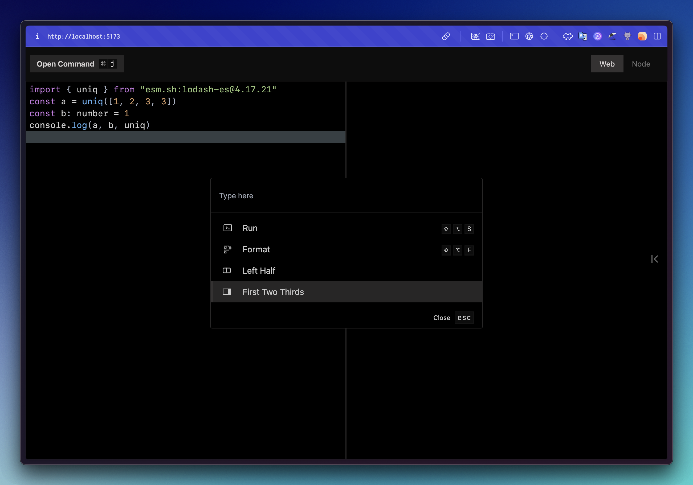

<div align='center' width="128">


  
*▲ A Replit client based on vite*

[](https://github.com/vsit/tree/main) [](https://github.com/vsit/tree/main)

</div>





```
pnpm i vsit -g
vsit
```

## features

- 💞 Import packages from [`esm.sh`](https://esm.sh/) without installed
- 🎹 Manage window, run code, format code with commands
- 💪 Typescript support

## development

- **Setup** - `pnpm i`
- **Build** - `pnpm build`

# 
<div align='right'>

*built with ❤️ by 😼*

</div>
